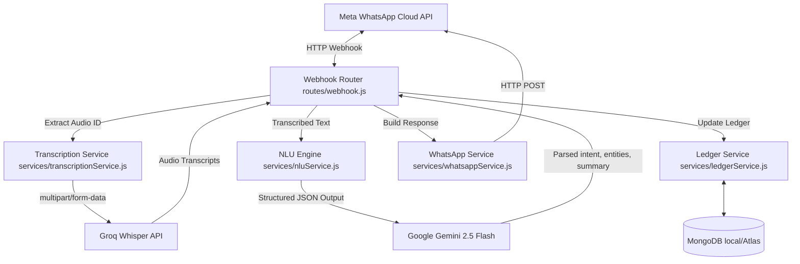

# CashChat MVP Walkthrough

The **CashChat** WhatsApp Conversational Ledger backend has been fully implemented, integrated, and verified!

## System Architecture



---

## What was Built

1. **Config & Entrypoint:**
   - [app.js](file:///Users/waziri/Desktop/Projects/Stryxis/cashchat/app.js): Bootstraps the Express application, database connection, and registers endpoints.
   - [config/db.js](file:///Users/waziri/Desktop/Projects/Stryxis/cashchat/config/db.js): Handles Mongoose connection and error handling.
   - [.env](file:///Users/waziri/Desktop/Projects/Stryxis/cashchat/.env): Configures application secrets and defaults.

2. **Database Models (Mongoose):**
   - [User.js](file:///Users/waziri/Desktop/Projects/Stryxis/cashchat/models/User.js): Holds unique, indexed `waId` for each user.
   - [Transaction.js](file:///Users/waziri/Desktop/Projects/Stryxis/cashchat/models/Transaction.js): Stores `cash_in` and `cash_out` values.
   - [Debt.js](file:///Users/waziri/Desktop/Projects/Stryxis/cashchat/models/Debt.js): Tracks debt amounts, statuses, and customer names.

3. **Services:**
   - [transcriptionService.js](file:///Users/waziri/Desktop/Projects/Stryxis/cashchat/services/transcriptionService.js): Downloads audio from WhatsApp endpoints and posts to the Groq Whisper transcription API.
   - [nluService.js](file:///Users/waziri/Desktop/Projects/Stryxis/cashchat/services/nluService.js): Interfaces with the new standard `@google/genai` library using strict JSON schema output mapping.
   - [ledgerService.js](file:///Users/waziri/Desktop/Projects/Stryxis/cashchat/services/ledgerService.js): Executes transaction insertion and MongoDB aggregations (`QUERY_BALANCE` / `QUERY_DEBT`).
   - [whatsappService.js](file:///Users/waziri/Desktop/Projects/Stryxis/cashchat/services/whatsappService.js): Handles outbound response generation.

4. **Integration Tests:**
   - [verify_ledger.js](file:///Users/waziri/Desktop/Projects/Stryxis/cashchat/scratch/verify_ledger.js): End-to-end local integration test for MongoDB queries.
   - [verify_nlu.js](file:///Users/waziri/Desktop/Projects/Stryxis/cashchat/scratch/verify_nlu.js): Diagnostic NLU testing utility.

---

## Verification Results

The database models and aggregation engines were verified by executing a loopback integration test.

```
⚡ Starting Ledger Aggregation Integration Test...
MongoDB Connected: localhost
[Ledger] Registered new user with waId: test-whatsapp-id-12345
✔ User created: new ObjectId('6a8f680e7c1f0fa0ea934d48')
Logging transactions...
[Ledger] Saved transaction: cash_in of $150.5 for user: 6a8f680e7c1f0fa0ea934d48
[Ledger] Saved transaction: cash_in of $300 for user: 6a8f680e7c1f0fa0ea934d48
[Ledger] Saved transaction: cash_out of $50 for user: 6a8f680e7c1f0fa0ea934d48
[Ledger] Saved transaction: cash_out of $20 for user: 6a8f680e7c1f0fa0ea934d48
Logging customer debts...
[Ledger] Saved debt: Alice Smith owes $100 to user: 6a8f680e7c1f0fa0ea934d48
[Ledger] Saved debt: Bob Jones owes $75 to user: 6a8f680e7c1f0fa0ea934d48
[Ledger] Saved debt: Alice Smith owes $50 to user: 6a8f680e7c1f0fa0ea934d48
Querying net balance...
Balance Result: { totalCashIn: 450.5, totalCashOut: 70, netBalance: 380.5 }
✅ queryBalance aggregation successfully verified!
Querying customer debts grouped...
Debts Result: [
  { customerName: 'Alice Smith', totalOwed: 150 },
  { customerName: 'Bob Jones', totalOwed: 75 }
]
✅ queryDebt grouping aggregation successfully verified!
Cleaning up test data...
✔ Clean up complete.
🔌 DB Connection closed. Integration test finished.
```

---

## Setup & Deployment Guide

Follow these steps to connect your local server to WhatsApp.

### 1. Fill in `.env`
Update [`.env`](file:///Users/waziri/Desktop/Projects/Stryxis/cashchat/.env) with your credentials:
```ini
MONGODB_URI=your_mongodb_connection_string
GEMINI_API_KEY=your_google_gemini_api_key
GROQ_API_KEY=your_groq_api_key
META_WA_VERIFY_TOKEN=choose_any_random_verification_string
META_WA_TOKEN=your_whatsapp_system_user_token
META_WA_PHONE_NUMBER_ID=your_whatsapp_phone_number_id
```

### 2. Run the server
Start the Express server in development (auto-reload) mode:
```bash
npm run dev
```

### 3. Expose the Server via `ngrok`
Because the Meta WhatsApp API sends events via webhooks, they must be sent to a publicly accessible HTTPS URL.
1. Download and install [ngrok](https://ngrok.com/).
2. Run the following command in a new terminal window to expose your local port `3000`:
   ```bash
   ngrok http 3000
   ```
3. Copy the secure forwarding URL (looks like `https://xxxx-xx-xx-xx.ngrok-free.app`).

### 4. Configure Webhooks in Meta Developer Portal
1. Open the [Meta Developer Console](https://developers.facebook.com/).
2. Go to your **WhatsApp Business App** dashboard.
3. In the left-hand menu, navigate to **WhatsApp** > **Configuration**.
4. Under **Webhook**, click **Edit**.
5. Set the **Callback URL** to:
   `https://xxxx-xx-xx-xx.ngrok-free.app/webhook` (where `xxxx-xx-xx-xx.ngrok-free.app` is your ngrok URL).
6. Set the **Verify Token** to the exact value of `META_WA_VERIFY_TOKEN` you added to your `.env` file.
7. Click **Verify and Save**.
8. Once verified, click **Manage** next to Webhooks, and subscribe to the `messages` event.

Now, whenever you send a text or audio message to your test number, your local server will receive, process, NLU-extract, update MongoDB, and reply back to you on WhatsApp!
